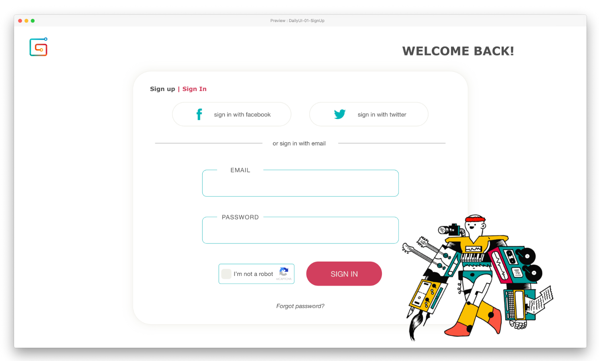

bB# DailyUI 01 : Gumroad Sign Up & Sign In Page

> Redesigning Gumroad's sign up and sign in page as part of the #DailyUI challenge.

## Background

I am a quite a fan of Gumroad as a business platform. But honestly, their UI/UX kind of suck (please don't sue me). As my first submission to the #DailyUI challenge, I decided to start with re-designing their sign up and sign in page ❤️

I tried to keep the branding behind Gumroad by using their color theme and assets. I feel like they have really good points with their front page robot-human illustration and phrases like "Do More of What You Love", so I try to incorporate them to my design. I initially wanted to turn the illustration into a gif with small moving parts, but i spent too much time on this project already. Perhaps next time!

## Color Theme

| COLOR  | HEX     | 🌈                                  |
| ------ | ------- | ----------------------------------- |
| Black  | #454545 |   |
| Grey   | #EDECE6 |    |
| Red    | #C04355 |     |
| Blue   | #36A9AE |    |
| Yellow | #FABE00 |  |
| Salmon | #F27F6D |  |

## Tools

-   Adobe XD
-   HTML5
-   CSS3

## License

[MIT Licensce](./LICENSE) © AmiraDeuraseh
Free for personal and commercial use. Just credit me where its due.

## Links

[Twitter](https://twitter.com/amiradeu)  
[My Gumroad](http://amirajo.gumroad.com/)
